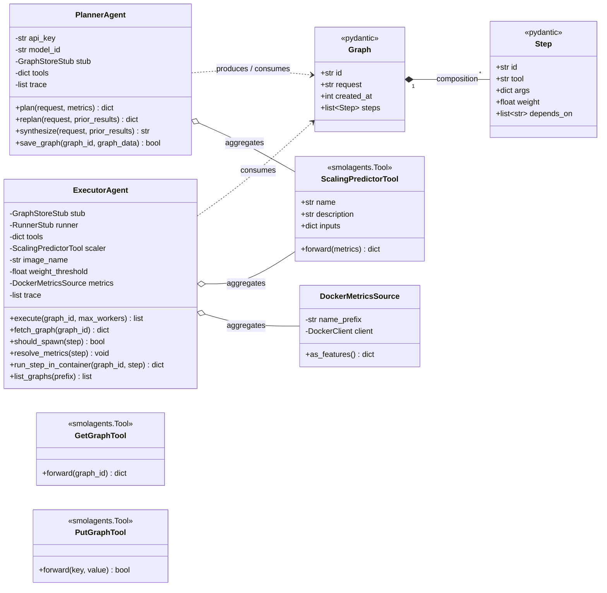
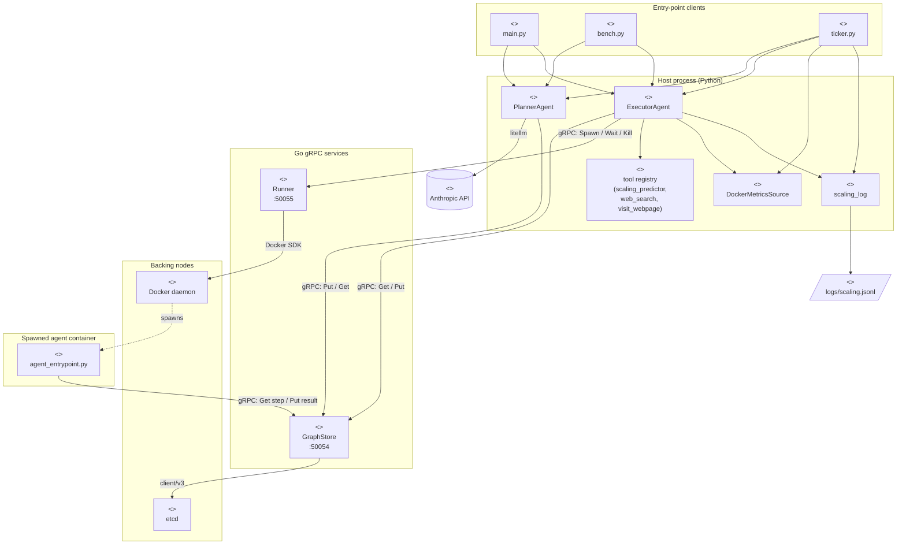
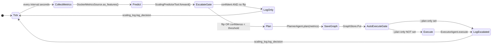

# Behavior Regulation Environment Handler

## Focusing on Sustainable Cloud Scaling Utilizing Agentic AI

Masters capstone integrating:
- **Project 3**: ML scaling prediction (XGBoost classifier)
- **Project 5**: Function calling insight (LLM native tool use)
- **Project 6**: Agentic orchestration patterns (smolagents)

## Structure

```
cmd/storage/       Go gRPC server (etcd wrapper)
internal/storage/  Go etcd client
proto/             gRPC service definitions
gen/
  storagepb/       Generated Go protos
  python/          Generated Python protos
tools/             ScalingPredictorTool (Project 3)
models/            Trained ML artifacts (.pkl)
agents/            Planner (LLM) and Executor agents
main.py            CLI entry point
```

## Setup

```bash
pip install -r requirements.txt
task install-tools
task vendor-googleapis
task                    # generates Go + Python protos
task etcd:start
```

## Demo

```bash
# Terminal 1: storage server
task storage:run

# Terminal 2: runner server
task runner:run

# Terminal 3: ticker server
python ./demo/ticker.py --interval 5 --threshold 0.55 --cooldown 60

# Terminal 4: bench test
python bench.py prompts.sample.json results.csv --seeds 1 --throttle 10
```

## Run

```bash
# Terminal 1: storage server
task storage:run

# Terminal 2: CLI
python main.py --plan "High latency detected"
python main.py --execute <graph_id>
python main.py --list
```

## Architecture

The system splits planning, storage, execution, and isolation across language
boundaries (Python orchestration, Go infrastructure) connected by gRPC. The
central thesis: a single LLM round-trip emits a DAG, the executor walks that
DAG with frontier-based parallel dispatch, and per-step routing decides
between fast inline calls and isolated container spawns.

### UML Class Diagram — domain model

The orchestration classes, their public surface, and how they relate. `Graph`
and `Step` are the pydantic-validated data contract that flows through every
edge of the system.



### UML Component Diagram — system topology

Components, their stereotypes, and the gRPC / HTTP / Docker interfaces that
connect them. Following the standard Mermaid convention for component
diagrams (`<<component>>`, `<<node>>`, `<<artifact>>` stereotypes) since
Mermaid lacks a dedicated component-diagram type.



### UML Sequence Diagram — plan → execute → replan

One LLM round-trip emits a DAG; the executor runs every ready step in
parallel; one `replan` call decides whether the request is answered or
another DAG is needed. This is the round-trip asymmetry that beats smolagent
on wall-clock for decomposable tasks.

```mermaid
sequenceDiagram
    participant U as main.py
    participant P as PlannerAgent
    participant S as GraphStore (etcd)
    participant E as ExecutorAgent
    participant L as LLM (Anthropic)

    U->>P: plan(request, metrics)
    P->>L: prompt(tools, metrics)
    L-->>P: JSON DAG
    P->>P: Graph(**dict) pydantic validate
    P->>S: Put(graph)
    P-->>U: graph dict

    loop until "done" OR max-iterations
        U->>E: execute(graph_id)
        E->>S: Get(graph_id)
        S-->>E: graph
        E->>E: frontier dispatch (see Activity)
        E-->>U: results[]
        U->>P: replan(request, accumulated)
        P->>L: prompt(compressed results)
        L-->>P: {status, answer | graph}
        alt status == "continue"
            P->>S: Put(new graph)
            U->>U: graph_id = new
        else status == "done"
            U-->>U: print answer; break
        end
    end
    Note over U,P: fallback if loop exits without answer
    U->>P: synthesize(request, accumulated)
    P->>L: prompt(final-answer from partial results)
    L-->>P: text
```

### UML Activity Diagram — `ExecutorAgent.execute`

The frontier-based dispatch loop, rendered as a state-machine activity
diagram (Mermaid's UML-compatible activity-flavor). The closed-loop part is
the `resolve_metrics` action: live container telemetry overrides the
LLM-fabricated args at execute time, so the trained classifier reads real
metrics, not whatever the planner guessed.

```mermaid
stateDiagram-v2
    direction TB
    [*] --> FetchGraph
    FetchGraph --> BuildIndex : graph != null
    FetchGraph --> [*] : graph == null (return [])
    BuildIndex --> CheckReady : in_degrees, successors

    state CheckReady <<choice>>
    CheckReady --> SortReturn : ready empty AND no in-flight
    CheckReady --> Submit : ready non-empty
    Submit --> Wait : pool.submit each ready step
    Wait --> RunOne : FIRST_COMPLETED future
    state RunOne {
        [*] --> WeightGate
        state WeightGate <<choice>>
        WeightGate --> Skipped : weight < threshold
        WeightGate --> ResolveMetrics : weight >= threshold
        ResolveMetrics --> RouteDecision : inject live telemetry<br/>(scaling_predictor only)
        state RouteDecision <<choice>>
        RouteDecision --> Container : RUNNER_ADDR AND should_spawn
        RouteDecision --> Inline : otherwise

        state Container {
            [*] --> Spawn
            Spawn --> WaitContainer : Runner.Spawn
            WaitContainer --> GetResult : Runner.Wait
            GetResult --> KillContainer : GraphStore.Get<br/>graph_id:results:step_id
            KillContainer --> [*] : Runner.Kill (best-effort)
        }

        state Inline {
            [*] --> Forward
            Forward --> [*] : tools[step.tool].forward(**args)
        }

        Container --> LogDecision
        Inline --> LogDecision
        LogDecision --> TraceAppend : if scaling_predictor:<br/>scaling_log.log_decision
        TraceAppend --> [*] : append result
        Skipped --> [*]
    }

    RunOne --> Advance
    Advance --> CheckReady : decrement successors[sid];<br/>promote in_degree==0 to ready
    SortReturn --> [*] : results.sort by weight
```



### UML Activity Diagram — `ticker.py` continuous loop

Classifier-first; LLM planner only fires on uncertainty or decision-flip.



### File index

| Path | Role |
|---|---|
| `main.py` | CLI driver: `--plan`, `--execute` (with replan loop), `--list` |
| `bench.py` | Runs BREH and smolagent over the same prompts, emits CSV |
| `ticker.py` | Continuous classifier-with-escalation loop |
| `agent_entrypoint.py` | Container-side: read env, run one step, write result to etcd |
| `agents/planner.py` | LLM round-trips: `plan`, `replan`, `synthesize`, `save_graph` |
| `agents/executor.py` | DAG fetch, frontier dispatch, container/inline routing |
| `agents/schema.py` | Pydantic `Graph` / `Step` validation models |
| `tools/scaling_tool.py` | XGBoost `ScalingPredictorTool` (Project 3 model) |
| `tools/docker_metrics.py` | Live container metrics → feature dict |
| `tools/scaling_log.py` | Append-only JSONL audit log of every scaling decision |
| `tools/etcd_tool.py` | `GetGraphTool` / `PutGraphTool` for the in-container path |
| `cmd/storage/` | Go gRPC server wrapping etcd (port 50054) |
| `cmd/runner/` | Go gRPC server wrapping Docker (port 50055) |
| `proto/` | Source-of-truth schemas; regenerated into `gen/` by `task` |
| `models/` | Trained classifier artifacts (`*.pkl`) |
| `logs/scaling.jsonl` | Per-decision audit log written by `scaling_log` |

### Cleanup / dead code (not blocking turn-in, but worth a pass)

These won't change behavior, but they're loose ends a reader will notice:

- **`agents/runner_client.py`** — only contains an unused import line. Either
  delete the file or move runner-channel construction into it.
- **`tools/__init__.py:31`** — `'direct_answer_tool'` is in `__all__` but the
  symbol is never defined anywhere. Stale export.
- **`name_prefix="makakasiguro"`** in `ExecutorAgent.__init__` — accepted as a
  kwarg but never assigned to `self` or forwarded to `DockerMetricsSource`
  (which *does* accept a `name_prefix` to filter containers). Either wire it
  through (`DockerMetricsSource(name_prefix=name_prefix)`) or drop the param.
- **`ExecutorAgent.delete_graph`** — defined, never called. If it's an admin
  hook keep it; otherwise remove.
- **`ListGraphsTool`** — exported from `tools/__init__.py` but never
  instantiated. The CLI `--list` path uses `ExecutorAgent.list_graphs`
  directly. Drop the tool wrapper unless the in-container path needs it.
- **Root-level result artifacts** — `results_main.csv`, `results_my_main.csv`,
  `results_v1.csv`, `results_answers_main/`, `results_answers_v0/`,
  `runner.log`, `storage.log` are all checked into the working tree. Move
  under a `results/` directory and add to `.gitignore`.
- **README "Structure" block (lines 10–21 above)** — lists `cmd/storage/` and
  `tools/`/`agents/` but predates `cmd/runner/`, `ticker.py`, `bench.py`,
  `agent_entrypoint.py`, `tools/docker_metrics.py`, `tools/scaling_log.py`.
  The file index table above is the up-to-date version; consider deleting
  the older block to avoid drift.
